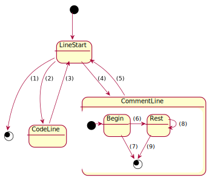

### Informal specification

#### Example: correct syntax

```bash
#
# @module module name here
#
# Here is a place for some documentation.
# @module directive starts documentation of a file.
#
# Empty line starts a new paragraph
#
# @authors Author Name <author.name@domain.com>
#
# Documentation can be interspersed by directives. It will be
#     joined together in the final documentation.
#  Unnecesary and inconsistent indentation is allowed
#
# Empty lines are not required between text and directives.
# @author
#   Another Author <another.author@domain.com>
#   
#   Different Author <different.author@domain.com>
#
# Directives @author and @authors are aliases. All authors will be merged together.
# If authors are on a new line, they must be indented. Each author can span only single line.

#
# @func This is short description: this function does this
#   and that (continuation is indented)
# This is part of long documentation because is not indented. sentence 1.
# Sentence 2
#
# A new documentation paragraph here.
#
# @arg name type description
#
# @args
#   name type this is a very
#       long description
#
#   name2 type2 description2
#
# Similarly to @author/@authors, directives @arg, @args are aliases.
# Their content will be merged together.
#
# @exitcode 5 description
#
# @exitcodes
#   0 description
#   >0 failure
#
# Directive @exitcode/@exitcodes behaves similarily to @arg/@args
#
# @stdin What is expected on stdin
# @stdout What will be on stdout
#
#   Here is even another paragraph
# @stderr What will be on stderr
#
# Directives @std* can be provided only once for given function
#
# @see other::function
#
# @see
#   a_different_function
#   and_one::more
#
function some::name {
}

# @func Function defined without 'function' keyword
other::function()
{
}

# More notes:
# 1. Directive is allowed only at the beginning of a comment line and must be unindented.
```

#### Example: syntax errors

* `@module` directive must precede any other module-level directive

```bash
# Error one next directive: no preceding @module directive
#
# @authors Author Name <author.name@domain.com>
```

* All module-level directives must be in the same comment block

```bash
# @module my-module

# Error one next directive: not in the same comment block as @module
#
# @authors Author Name <author.name@domain.com>
```

* `@func` directive must precede any other func-level directive

```bash
# Error one next directive: no preceding @func directive
#
# @arg name type description
```

*  All func-level directives must be in the same comment block

```bash
# @func This is my func

# Error one next directive: not in the same comment block as @func
#
# @see Author Name <author.name@domain.com>
```

* function documentation comment block must be immediatelly followed by function definition

```bash
# @func This is short description
#
# Error in above directive: function documentation not followed by function definition

function some::name {
}
```

* directive cannot be indented

```bash
#   @module my-module
#
# Error in above directive: directive must not be indented
```

#### Example: warnings

* function definition must be immediatelly preceded by function documentation comment block

```bash
# @func This is short description

# Error below: undocumented function definition
function some::name {
}
```


### Lexical analysis

Lexical analysis is performed line-wise - no token can span multiple lines.
Each line of text is a source of zero or more tokens.

Lexer is stateful. It works according to following state machine:



In each state the lexer tries to match at current position a pattern from a list of allowed in given state. An invariant is maintained, that at the start of each new line
and at the start and end of the input, the lexer is in a _LineStart_ state.

* _LineStart_ - following patterns can be matched
  * **(1)** - _end-of-input_
  * **(2)** - begining of a code line

### Grammar
This grammar uses EBNF notation, with a simple extension that reduces grammar size.
Productions can be parameterized. Parameters can be set to both non-terminals and terminals.
Parameterized productions behave as templates, which are instantiated whenever parameterized
non-terminal is used with actual parameter values.

In this grammar, symbols are lines of input bash script

```EBNF
file                    = block EOF ;

block                   = INDENT block DEDENT
                        | comment
                        | module
                        | function
                        ;

comment                 = text ;

module                  = MODULE-DIRECTIVE text { module-item } ;

module-item             = paragraphs
                        | authors
                        ;


text                    = { TOKEN } EOL ;

paragraphs              = paragraph { EOL paragraph } ;

paragraph               = text { text } ;

------


file = { ignored-symbol } , [ header ] , { ignored-symbol | definition } ;

header = directive(module-symbol) , { header-attribute | spacing-symbol } ;

header-attribute = directive(author-symbol) ;    (* more header attributes here *)

directive(directive-symbol) = directive-symbol ;

definition = func-definition ;   (* more definitions here *)

func-definition = directive(func-symbol) , { func-attribute } ;

func-attribute = text ; (* TODO: arg status output *);


ignored-symbol  = ? any line not recognized as specific symbol ?;

spacing-symbol  = ? line matching '^# *$' ?     (* empty line in comment *)

module-symbol   = ? line matching '^# @module ' ?
author-symbol   = ? line matching '^# @author ' ?

func_symbol .......
```
